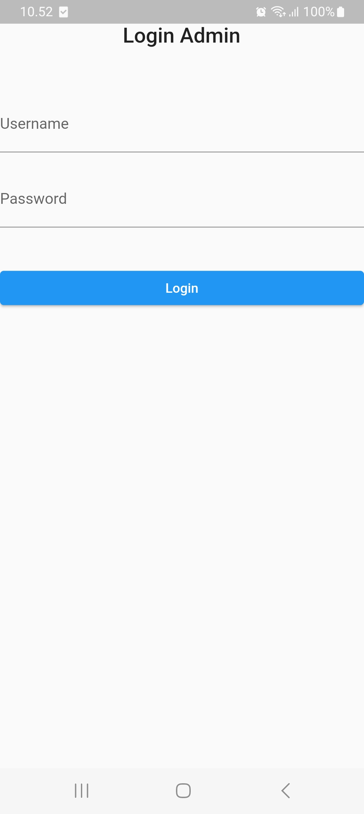
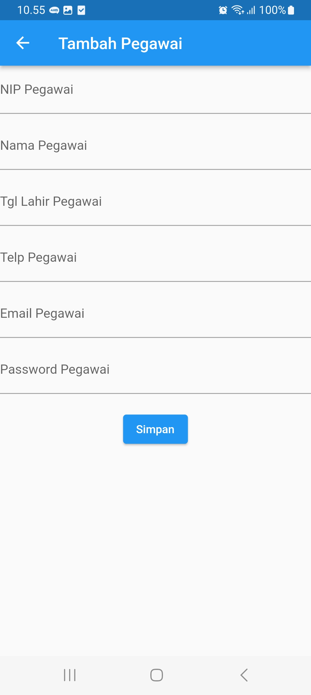
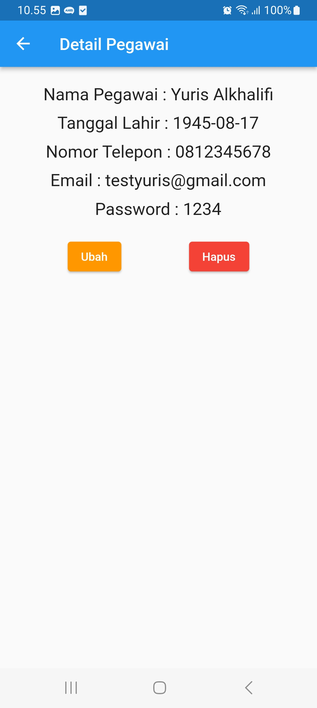

# klinik_app
 

Lorem ipsum dolor sit amet, consectetur adipiscing elit. Quisque lobortis tortor dictum, semper quam ut, vestibulum nisi. Fusce posuere erat vitae sodales tincidunt. Duis rhoncus orci nec nisi fringilla, vitae aliquam tellus facilisis. Nulla rhoncus vel ligula in placerat. Praesent cursus massa id auctor lacinia. Praesent eu dui non libero aliquet lacinia. Morbi varius ante est, sit amet scelerisque magna tempor at. Ut porttitor condimentum urna ac fringilla. Nunc accumsan varius sapien nec venenatis. In convallis elementum sapien, nec commodo erat tempus quis. Aliquam cursus ex eu magna molestie pharetra. Duis semper ut orci sit amet viverra. Pellentesque malesuada urna in auctor lobortis.

## Nama Kelompok
<table border="1">
  <thead>
    <tr>
      <td>No</td>
      <td>NIM</td>
      <td>Nama Kelompok</td>
    </tr>
  <thead>
  <tbody>
    <tr>
      <td>1</td>
      <td>12345678</td>
      <td>Maman Hidayat</td>
    </tr>
    <tr>
      <td>2</td>
      <td>23456789</td>
      <td>Joko Nashiruddin</td>
    </tr>
    <tr>
      <td>3</td>
      <td>34567890</td>
      <td>Prayoga Kusumo</td>
    </tr>
    <tr>
      <td>4</td>
      <td>34567890</td>
      <td>Anom Nababan</td>
    </tr>
  </tbody>
</table>

## Pengguna Sistem
Pengguna yang dapat memakai sistem ini adalah Admin & User.

## Skenario Kebutuhan Pengguna
### Admin
<ol>
  <li>Lorem ipsum dolor sit amet, consectetur adipiscing elit. Quisque lobortis tortor dictum</li>
  <li>Semper quam ut, vestibulum nisi. Fusce posuere erat vitae sodales tincidunt</li>
  <li>Duis rhoncus orci nec nisi fringilla, vitae aliquam tellus facilisis</li>
</ol>

### User
<ol>
  <li>Lorem ipsum dolor sit amet, consectetur adipiscing elit. Quisque lobortis tortor dictum</li>
  <li>Semper quam ut, vestibulum nisi. Fusce posuere erat vitae sodales tincidunt</li>
  <li>Duis rhoncus orci nec nisi fringilla, vitae aliquam tellus facilisis</li>
</ol>

## Screenshot Aplikasi
<table width="100%">
  <tbody>
    <tr>
      <td width="33%">
         
        <h5 style="text-align: center">Login Form</h5>
      </td>
      <td width="33%">
        
        <h5 style="text-align: center">Form Tambah Pegawai</h5>
      </td>
      <td width="33%">
        
        <h5 style="text-align: center">Form Detail Pegawai</h5>
      </td>
    </tr>
  </tbody>
</table>

## Credit
Project ini mengacu pada modul praktik dari mata kuliah Mobile Programming Universitas Bina Sarana Informatika (UBSI) yang diampu oleh Bpk. <a href="https://yurisalkhalifi.com/">Yuris Alkhalifi, M.Kom., CPDSA</a> selaku Dosen.